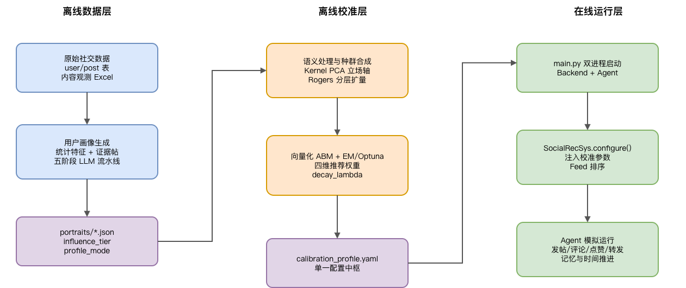
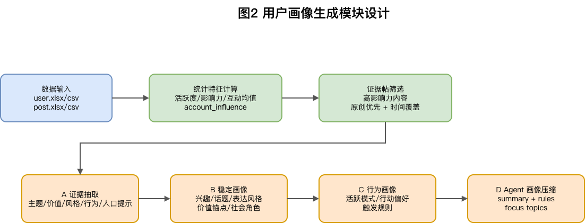
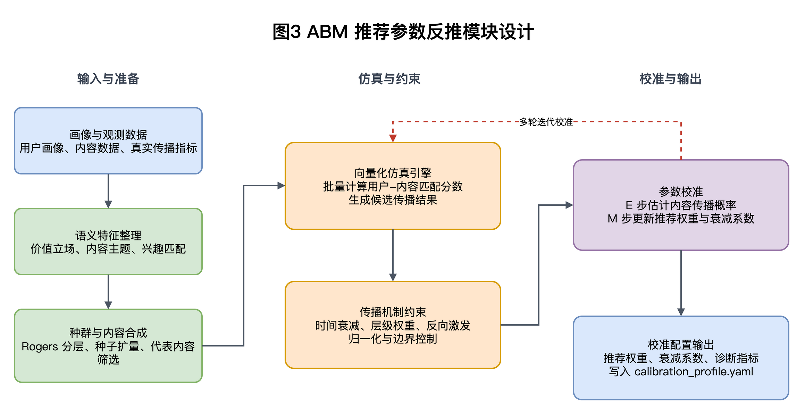

__中国传媒大学硕士研究生学位论文及__

__毕业作品选题报告申请表__

姓    名：张艺鹏                     学    号：202520085411016

责任导师：黄浩程                     培养单位：媒体融合与传播国家重点实验室

领域及代码：085411                   研究方向：数据智能技术与应用

论文题目

融合推荐机制校准的社交仿真平台设计与实现

作品题目

无

选题相关文献阅读及案例调研等情况

近年来，基于大语言模型（large language model, LLM）的智能体社交仿真正在成为传播学、计算社会科学与人工智能交叉研究的重要方向。传统社交网络仿真主要依赖 Agent\-Based Modeling、Bounded Confidence、SIR、元胞自动机、Hawkes 过程等规则模型，优势在于参数可解释、计算成本低、适合大规模推演，但普通个体常被简化为数值状态，难以解释真实平台中用户为什么发帖、评论、转发、沉默或改变立场。LLM Agent 的出现使虚拟个体能够基于画像、记忆、信念和上下文生成自然语言行为，为社交平台传播机制研究提供了新的方法。

__1\. LLM Agent 与混合仿真研究。__

Park 等提出 Generative Agents，通过记忆流、反思和计划机制模拟 25 个虚拟个体的日常社会互动，证明语言模型能够在受控环境中生成较连贯的社会行为。随后，CoALA 从认知架构角度将语言智能体抽象为工作记忆、情节记忆、语义记忆和程序记忆的组合，为后续 Agent 设计提供了理论参照。但纯 LLM 架构存在推理成本高、规模扩展困难和长程稳定性不足等问题。因此，HiSim、FDE\-LLM、GASim、TopoSim、APS 等研究逐渐转向 LLM\-ABM 混合框架：少数核心用户由 LLM 驱动，负责复杂语义理解与关键行为生成；大量普通用户由规则模型或轻量模型驱动，负责低成本互动模拟。这一思路与本课题拟采用的“大模型核心用户 \+ 小模型/规则普通用户”分层架构高度一致。

1. __社交平台化系统与推荐机制研究。__

OASIS 是较具代表性的百万级社交平台仿真系统，包含 Environment Server、RecSys、Agent Module、Time Engine 和 Scalable Inferencer 等模块，并在 Twitter/X 与 Reddit 场景中复现信息扩散、群体极化和羊群效应。GGBond 将推荐算法嵌入多轮社会反馈过程，POSIM 将 BDI 架构、Hawkes 点过程与推荐排序结合，PolicySim 则将推荐系统视为可优化的平台干预策略。这些研究说明推荐系统已不再只是平台背景，而是决定 Agent 信息曝光、互动机会和态度变化的关键机制。但现有系统中的推荐参数多来自人工预设、经验公式、通用排序规则或离线调参，尚未充分解决“如何从真实传播结果反推推荐参数并注入在线仿真”的问题。

1. __推荐参数校准与机制解释研究。__

推荐系统和奖励学习领域为本课题提供了方法论借鉴。MTRec 通过分布逆强化学习从用户隐式反馈中反推满意度奖励函数，提示点击、停留、转发等行为并不等同于真实偏好，需要通过观测行为识别潜在机制。Beyond Imitation 从理论上讨论了从观测行为反推奖励函数的可行性，EM 算法、贝叶斯优化和 Optuna 等方法也可用于存在隐变量和不完全观测条件下的参数估计。将这些方法引入社交仿真，可以把推荐系统中的兴趣匹配、内容热度、时间衰减、随机探索等因素转化为可估计、可解释和可消融的参数。

1. __Agent 画像、验证与评估研究。__

LLM Agent 的可信度不仅取决于语言生成能力，也取决于画像分布、记忆机制、信念更新和评估框架。Two\-stage LLM User Profiling、TWICE、Population\-Aligned Persona Generation 等研究分别从用户画像生成、时间动态画像和群体分布对齐角度改进 Agent 表征。HiSim 的 SoMoSiMu\-Bench 从微观行为对齐和宏观态度分布两个层面评估仿真结果；FDE\-LLM 使用 DTW 与 Pearson 相关系数衡量态度曲线与真实曲线的一致性；EASE/SiliSocS 将环境、Agent、仿真引擎和评估指标形式化为可配置模块；TRAILS 则强调 Prompt、模型版本、网络结构和随机种子扰动会显著影响仿真结果，因而需要鲁棒性审计。

综上，现有研究已经形成从经典认知架构、LLM\-ABM 混合仿真、平台化系统到多维评估的基本脉络，但在推荐机制实证校准方面仍存在明显空白。真实社交平台的信息扩散并非单纯的邻居传播或随机曝光，而是由推荐算法持续决定用户看到哪些内容、以何种顺序看到内容，并进一步影响互动与态度演化。如果推荐权重完全由研究者主观设定，仿真中出现的信息扩散、回音室效应或群体极化就难以判断究竟来自用户行为模型、网络结构，还是人为设定的曝光机制。本课题拟在既有综述和项目基础上，以“推荐算法参数校准”为核心切入点，形成“真实传播数据治理—规则 ABM 参数反推、校准参数注入、大小模型分层仿真、多指标验证”的闭环研究路径，提升社交网络仿真平台的现实参照、机制解释力和可复用性。

__参考文献__

\[1\] Park, J\. S\., O'Brien, J\. C\., Cai, C\. J\., Morris, M\. R\., Liang, P\., & Bernstein, M\. S\. \(2023\)\. Generative Agents: Interactive Simulacra of Human Behavior\. UIST 2023\. arXiv:2304\.03442\.

\[2\] Sumers, T\. R\., Yao, S\., Narasimhan, K\., & Griffiths, T\. L\. \(2024\)\. Cognitive Architectures for Language Agents\. Transactions on Machine Learning Research\. arXiv:2309\.02427\.

\[3\] Mou, X\., Wei, Z\., & Huang, X\. \(2024\)\. Unveiling the Truth and Facilitating Change: Towards Agent\-based Large\-scale Social Movement Simulation\. Findings of ACL 2024\. arXiv:2402\.16333\.

\[4\] Yao, J\., Zhang, H\., Ou, J\., Zuo, D\., Yang, Z\., & Dong, Z\. \(2025\)\. Social Opinions Prediction Utilizes Fusing Dynamics Equation with LLM\-based Agents\. Scientific Reports, 15, 15472\. arXiv:2409\.08717\.

\[5\] Zhou, X\., Sun, Y\., Yao, H\., He, A\., Zhang, Y\., & Liu, W\. \(2026\)\. GASim: A Graph\-Accelerated Hybrid Framework for Social Simulation\. arXiv:2605\.07692\.

\[6\] Xu, Y\., Zhang, S\., Zhou, Y\., Zeng, S\., Lakshmanan, L\. V\. S\., & Ma, C\. \(2026\)\. Topology\-Aware LLM\-Driven Social Simulation: A Unified Framework for Efficient and Realistic Agent Dynamics\. arXiv:2604\.18011\.

\[7\] Zheng, Q\., Gao, Y\., He, S\., Guan, H\., Tian, Y\., Feng, J\., Wang, M\., Zheng, S\., & Liu, Z\. \(2026\)\. APS: Bias\-Controlled Adaptive Prototype Simulation for Population\-Scale LLM Agents\. arXiv:2605\.27419\.

\[8\] Yang, Z\., Zhang, Z\., Zheng, Z\., Jiang, Y\., Gan, Z\., Wang, Z\., Ling, Z\., et al\. \(2024\)\. OASIS: Open Agent Social Interaction Simulations with One Million Agents\. arXiv:2411\.11581\.

\[9\] Zhang, B\., Yang, Y\., Niu, F\., Fu, X\., Dai, G\., & Huang, H\. \(2025\)\. SPARK: Simulating the Co\-evolution of Stance and Topic Dynamics in Online Discourse with LLM\-based Agents\. EMNLP 2025\.

\[10\] Koley, G\. \(2025\)\. SALM: A Multi\-Agent Framework for Language Model\-Driven Social Network Simulation\. arXiv:2505\.09081\.

\[11\] Zhong, H\., Wang, H\., Ye, Y\., Zhang, M\., & Zhu, S\. \(2025\)\. GGBond: Growing Graph\-Based AI\-Agent Society for Socially\-Aware Recommender Simulation\. arXiv:2505\.21154\.

\[12\] Zhang, Y\., Qiao, K\., Wang, Z\., Liang, N\., Ma, D\., Sun, W\., Chen, J\., & Yan, B\. \(2026\)\. POSIM: A Multi\-Agent Simulation Framework for Social Media Public Opinion Evolution and Governance\. arXiv:2603\.23884\.

\[13\] Huang, R\., Tang, N\., Xu, J\., et al\. \(2026\)\. PolicySim: An LLM\-Based Agent Social Simulation Sandbox for Proactive Policy Optimization\. WWW 2026\. arXiv:2603\.19649\.

\[14\] Liu, Y\., Liu, W\., Gu, X\., He, A\., Wang, W\., & Zhang, Y\. \(2025\)\. PopSim: Social Network Simulation for Social Media Popularity Prediction\. arXiv:2512\.02533\.

\[15\] Tomašević, A\., Cvetković, D\., Major, S\., Maletić, S\., Anđelković, M\., Vranić, A\., et al\. \(2025\)\. Towards Operational Validation of LLM\-Agent Social Simulations: A Replicated Study of a Reddit\-like Technology Forum\. arXiv:2508\.21740\.

\[16\] Ye, J\., Cao, L\., Chen, D\., & Ferrara, E\. \(2026\)\. Stop Drawing Scientific Claims from LLM Social Simulations Without Robustness Audits\. arXiv:2605\.18890\.

\[17\] Zhao, P\., Pham, D\. H\., & Vincent, N\. \(2026\)\. Mechanism Plausibility in Generative Agent\-Based Modeling\. ACM FAccT 2026\. arXiv:2605\.12824\.

\[18\] Sarangi, S\., Puelma Touzel, M\., Bück\-Kaeffer, A\., Yang, Z\., Godbout, J\.\-F\., & Rabbany, R\. \(2026\)\. EASE Configuration Facilitates A Reproducible Science of LLM Social Simulations\. arXiv:2605\.30258\.

\[19\] Reji, D\. J\. \(2026\)\. LLM\-Agent\-based Social Simulation for Attitude Diffusion\. arXiv:2604\.03898\.

\[20\] Yang, Y\., Duan, Y\., Huang, L\., Zhu, Y\., et al\. \(2026\)\. ScioMind: Cognitively Grounded Multi\-Agent Social Simulation with Anchoring\-Based Belief Dynamics and Dynamic Profiles\. arXiv:2605\.13725\.

\[21\] Zhang, Y\., Ai, Y\., Ying, Z\., Mi, Q\., Yu, J\., Yang, W\., & Song, Z\. \(2026\)\. Coupling Macro Dynamics and Micro States for Long\-Horizon Social Simulation\. arXiv:2604\.05516\.

\[22\] Zhao, M\., Gao, Y\., Hou, Y\., Li, X\., Gu, P\., Dong, Z\., Tang, R\., & Cai, Y\. \(2025\)\. MTRec: Learning to Align with User Preferences via Mental Reward Models\. NeurIPS 2025\. arXiv:2509\.22807\.

\[23\] Li, J\., Vu, T\.\-T\., Abbasnejad, E\., & Haffari, G\. \(2025\)\. Beyond Imitation: Recovering Dense Rewards from Demonstrations\. arXiv:2510\.02493\.

\[24\] Dempster, A\. P\., Laird, N\. M\., & Rubin, D\. B\. \(1977\)\. Maximum Likelihood from Incomplete Data via the EM Algorithm\. Journal of the Royal Statistical Society: Series B, 39\(1\), 1\-38\.

\[25\] Rahimzadeh, V\., Hamzehpour, A\., Shakery, A\., & Asadpour, M\. \(2025\)\. From Millions of Tweets to Actionable Insights: Leveraging LLMs for User Profiling\. ICWSM 2025 Workshop\. arXiv:2505\.06184\.

\[26\] Jin, B\., Lan, K\., & Wu, M\. \(2026\)\. TWICE: An LLM Agent Framework for Simulating Personalized User Tweeting Behavior with Long\-term Temporal Features\. arXiv:2602\.22222\.

\[27\] Hu, Z\., Lian, J\., Xiao, Z\., Xiong, M\., Lei, Y\., Wang, T\., Ding, K\., Xiao, Z\., Yuan, N\. J\., & Xie, X\. \(2025\)\. Population\-Aligned Persona Generation for LLM\-based Social Simulation\. arXiv:2509\.10127\.

\[28\] Lin, R\. F\., Tian, K\., Zheng, H\., Zhang, C\., Zeng, L\., & Huang, S\. \(2025\)\. CrowdLLM: Building LLM\-Based Digital Populations Augmented with Generative Models\. arXiv:2512\.07890\.

\[29\] Nielsen, J\. \(2006\)\. The 90\-9\-1 Rule for Participation Inequality in Social Media and Online Communities\. Nielsen Norman Group\.

\[30\] Xue, D\., Cui, J\., Qian, S\., Hu, C\., & Xu, C\. \(2025\)\. SoMe: A Realistic Benchmark for LLM\-based Social Media Agents\. AAAI 2026\. arXiv:2512\.14720\.

\[31\] Münker, S\., Schwager, N\., & Rettinger, A\. \(2025\)\. Don't Trust Generative Agents to Mimic Communication on Social Networks Unless You Benchmarked their Empirical Realism\. arXiv:2506\.21974\.

选题报告

__一、选题依据__

社交媒体已经成为公众舆论形成、信息传播、社会事件扩散和平台治理的重要空间。突发事件、公共议题、政策讨论与国际传播议题往往会在社交平台上快速扩散，并通过关注关系、转发链条、评论互动、点赞反馈和推荐系统形成复杂传播过程。对于传播学、公共治理、网络舆情分析和智能传播研究而言，理解特定事件中用户群体如何接触信息、如何产生互动、如何改变立场，具有重要的理论意义和实践价值。

然而，真实社交平台的运行机制具有明显黑箱特征。平台推荐算法、完整曝光日志和用户互动链路通常难以获得；在真实平台上开展大规模对照实验也受到隐私、伦理和监管限制。因此，构建可控、可复现、可验证的社交网络仿真平台，成为研究社交平台传播机制的重要路径。仿真平台的价值不仅在于复现若干宏观现象，更在于通过受控实验解释宏观现象如何从微观用户行为、网络结构和平台机制共同生成。

现有社交网络仿真大体经历了从规则 ABM 到 LLM Agent，再到混合架构和平台化系统的发展过程。规则 ABM 通过数学方程描述用户态度、互动概率和传播行为，具有成本低、规模大、参数可解释等优点，但在文本生成、情境理解和个体行为解释方面存在不足。LLM Agent 能够基于用户画像、记忆和上下文生成更接近真实用户的语言行为，但如果所有用户都由大模型驱动，则会面临调用成本高、规模扩展困难、输出稳定性不足和长程仿真状态漂移等问题。当前更可行的方向是采用大模型与小模型、规则模型分层协同的混合仿真框架：由大模型负责高影响力用户、复杂语言行为和关键内容生成，由小模型或规则 ABM 负责大规模普通用户的低成本互动模拟，从而兼顾行为保真度与系统可扩展性。

在这一发展脉络中，推荐机制是目前最需要进一步处理的关键环节。真实社交平台并不是简单的邻居传播系统，而是由推荐算法持续决定用户的信息曝光条件。用户看到哪些内容、何时看到、排序靠前还是靠后，会直接影响后续的点赞、评论、转发、沉默和态度变化。如果仿真平台中的推荐系统参数由研究者主观设定，仿真结果可能反映的是研究者预设的曝光规则，而不是真实传播过程中的机制规律。换言之，推荐机制不是社交仿真的外部背景，而是构成平台社会过程的内生变量。

已有综述表明，Generative Agents、HiSim、FDE\-LLM、SALM、SPARK、GASim、TopoSim、APS 等系统多数没有显式推荐机制，信息获取主要依赖邻居传播、时间线、物理空间或随机曝光。OASIS、GGBond、POSIM 等系统虽然引入了推荐模块或排序规则，但推荐参数多来自兴趣匹配公式、hot\-score、人工验证或离线调参，缺少面向真实传播数据的实证识别。PolicySim 关注在线推荐干预策略优化，但其重点是平台政策优化，而不是从真实传播结果反推推荐参数并迁移到社交仿真平台。因此，本课题将研究问题聚焦为：如何从真实传播数据中反推推荐系统关键参数，并将其注入 LLM Agent 与规则 Agent 协同运行的社交仿真平台，以提升仿真结果的可信度、解释力和可复用性。

本课题拟以“__融合推荐机制校准的社交仿真平台设计与实现__”为题，在已有认知传播数据治理、规则 ABM 参数反推和 MOSS 平台开发基础上，构建从离线校准到在线仿真的闭环系统。研究不试图还原真实商业推荐算法的全部内部细节，而是将推荐机制抽象为兴趣匹配、内容热度、时间衰减、随机探索等可解释维度，通过真实传播结果与模拟传播结果之间的拟合反推参数，再将校准参数写入统一配置并驱动在线仿真。该思路能够在可控实验条件下回答推荐参数对信息扩散、态度演化和平台涌现现象的影响，为传播机制研究提供更明确的因果链条。

__二、创新性__

第一，提出面向社交平台仿真的推荐系统参数校准方法。现有社交仿真研究中，部分系统没有推荐模块，部分系统虽然包含推荐模块，但参数多来自人工设定、经验公式或固定排序规则。本课题拟将推荐系统抽象为兴趣匹配、内容热度、时间衰减和随机探索等可解释评分维度，利用规则 ABM 对真实传播结果进行拟合，并通过 EM、Optuna 或贝叶斯优化等方法反推推荐权重和衰减参数。由此，推荐参数不再是独立于数据的主观假设，而是由真实传播过程反向校准得到。

第二，构建“离线参数校准—在线仿真运行”的全流程闭环。多数已有研究将数据准备、参数设定和仿真运行分散处理，校准结果与平台运行之间缺少稳定接口。本课题拟将离线阶段得到的推荐权重、时间衰减系数、行为阈值和实验元数据写入统一 YAML 配置文件，再由在线仿真平台读取并驱动推荐服务、Agent 决策和实验记录，实现从真实传播数据到仿真运行参数的自动流转。这一闭环设计有助于提高系统的可复现性和跨领域复用能力。

第三，设计大模型与小模型 Agent 分层协同的社交仿真架构。平台拟将用户划分为高影响力核心用户、普通互动用户两类。核心用户由能力较强的大模型驱动，承担原创发帖、复杂评论、转发理由生成和关键传播触发等任务；普通互动用户由小模型完成低成本互动。该设计既保留大模型在关键用户行为模拟中的表达能力，也降低大规模用户模拟成本，使平台在行为保真度、可解释性和运行效率之间取得平衡。

__三、选题难度和可行性__

本课题具有一定难度。首先，数据层面需要将真实社交媒体中的用户信息、帖子内容、互动行为和时间序列转化为可供仿真使用的结构化输入。真实数据通常存在噪声账号、机器人行为、缺失字段、互动链路不完整和平台采样偏差等问题，如果数据清洗和节点筛选不充分，后续画像生成、参数校准和仿真验证都会受到影响。其次，用户画像生成需要在有限证据帖基础上推断用户兴趣、表达风格、价值立场和行为偏好，既要避免过度推断，也要保证画像能够被 Agent 决策和 ABM 模块消费，因此对 Prompt 设计、结构化输出和字段校验提出较高要求。

其次，推荐参数反推本身具有较强方法复杂度。社交平台推荐机制并不可直接观测，本课题只能根据真实传播结果、互动分布和态度演化结果反推近似参数。这要求系统设计合理的推荐评分公式、参数搜索空间、损失函数和收敛判据，并处理兴趣权重、热度权重、时间衰减和随机探索之间可能存在的共线性与可辨识性问题。再次，在线仿真平台需要同时整合推荐服务、Agent 决策、记忆管理、时间推进、行为记录和结果可视化，不同模块之间如果评分公式、用户层级或配置接口不一致，容易造成离线校准和在线运行脱节。最后，LLM Agent 的输出具有随机性，仿真结果可能受到 Prompt、模型版本、采样参数和随机种子的影响，因此实验部分还需要进行多次运行、消融对比和鲁棒性分析。

本课题同时具备较好的可行性。第一，已有 LLM Agent 与 ABM 混合仿真研究为系统架构提供了可参考路径。HiSim 将核心用户与普通用户分层建模，说明少量 LLM Agent 与大规模规则用户协同运行具有可行性；FDE\-LLM 将 CA、SIR 与 LLM Agent 结合，并使用 DTW 和 Pearson 指标验证态度曲线，为本课题的动态评估提供了参考；OASIS 构建百万级社交平台仿真环境，并将推荐模块纳入系统架构，说明平台化社交仿真具备工程实现基础。

第二，用户画像生成和分层建模已有较成熟的技术基础。Two\-stage LLM User Profiling、TWICE、Population\-Aligned Persona Generation 等研究说明，可以从社交媒体文本中抽取用户兴趣、表达风格、行为模式和时间动态特征，并通过群体分布对齐降低画像偏差。Rogers 创新扩散理论和 90\-9\-1 参与不平等法则也为用户影响力分层提供了理论参考，使本课题能够将高影响力用户、普通互动用户和浏览型用户区分建模。

第三，推荐参数校准和 ABM 参数估计具有可借鉴的方法来源。EM 算法适合处理存在隐变量和不完全观测的数据，Optuna、贝叶斯优化和 Dirichlet 采样等方法可用于受约束参数搜索；MTRec、Beyond Imitation 等研究从隐式反馈和示范行为中反推潜在奖励或偏好，为“从观测传播结果反推推荐权重”提供了方法启发。将这些方法迁移到社交仿真场景，能够形成具有解释性的参数估计流程。

第四，系统实现所需的技术条件较为成熟。FastAPI、SQLite、向量检索、SentenceTransformer、LangChain、React/Vite 等工具均能支持前后端分离、语义检索、Agent 调度和结果可视化；LLM API 与开源小模型也能分别承担核心用户复杂决策和普通用户低成本交互生成。已有研究中的 SoMoSiMu\-Bench、EASE、TRAILS 等评估框架还为一致性评估、模块化配置和鲁棒性审计提供了参考。因此，本课题虽然涉及数据、算法和系统集成多个环节，但在理论、方法和工程工具上均有较充分的前人基础，可以按计划开展。

__四、研究工作方案__

本课题的研究工作方案不以论文章节撰写为中心，而以 MOSS 社交仿真系统的项目设计、模块实现和闭环验证为主线展开。系统拟形成“用户画像生成—ABM 推荐参数反推—在线社交网络模拟—结果归档与反馈校准”的端到端流程，使真实社交数据能够转化为可运行、可复现、可解释的仿真实验配置。

图1 MOSS 数据—校准—运行闭环总览。

__1\. 用户画像生成模块设计。__

用户画像生成模块是系统的数据基础层，输入为 user\.xlsx/csv 与 post\.xlsx/csv 等原始社交数据，输出为可供 ABM 校准和 Agent 运行消费的 portraits/\*\.json。模块首先计算用户统计特征，包括发帖数量、原创/转发/评论比例、互动均值、活跃时段、近期活跃度、粉丝数、帖子影响力和 account\_influence 等指标；随后从用户历史帖子中筛选高质量证据帖，优先保留高影响力、原创性强且覆盖不同时间段的内容。

在画像生成流程上，系统采用五阶段 LLM 流水线：证据抽取、稳定画像生成、行为画像生成、Agent 画像压缩和模拟初始状态生成。稳定画像描述语言偏好、长期兴趣、内容话题、表达风格、价值锚点、社会角色和人口统计推断；行为画像描述活跃模式、行动偏好、互动偏好、内容偏好和触发规则；Agent 画像进一步压缩为 identity\_summary、interest\_summary、value\_summary、style\_summary、behavior\_summary、speaking\_rules、action\_rules 和 avoidance\_rules 等运行字段。为控制成本，完整 LLM 流水线主要用于 Rogers 5 级体系中的 L4\-L5 高影响力种子用户，L1\-L3 大众用户采用 simple profile mode、bio \+ tier 预设行为库生成简化画像。

图2 用户画像生成模块

__2\. ABM 推荐参数反推模块设计。__

推荐参数反推模块是系统的核心校准层，目标是从真实内容传播观测数据中反推出在线推荐服务可直接使用的参数。模块首先通过 SemanticLoader 从画像 JSON 中提取 value\_anchors 和 content\_topics，使用 Kernel PCA 将多维价值立场投影到一维立场轴，并通过文本嵌入计算用户与内容之间的兴趣匹配度。PopulationSynthesizer 根据 Rogers 前 16% 种子用户假设自动扩量，采用精英保留、重采样、高斯噪声和 Zipf 影响力分布合成全量仿真种群。StoryManager 从内容观测 Excel 中筛选代表性内容，过滤传播量过低的样本，并用锚定百分位进行传播量归一化。

在仿真引擎上，系统采用向量化 ABM 同时更新全部 Agent 状态。推荐可见概率由兴趣匹配、内容热度、时间衰减和随机探索四个维度加权得到，权重分别记为 w\_i、w\_pop、w\_time、w\_rand，并通过 Per\-Batch Min\-Max 归一化消除量纲差异。时间维度采用 exp\(\-decay\_lambda \* dt\) 的指数衰减形式，decay\_lambda 纳入搜索空间；热度维度引入 TIER\_WEIGHT，使高影响力用户发布内容在传播中具有更高权重；信念更新引入 Soft Backfire 机制，模拟立场冲突时可能出现的逆火效应；行为门控则根据立场强度决定用户是否进一步转发或互动。

参数校准采用 EMCalibrationEngine：E 步针对每条代表性内容搜索内容级 p\_base，M 步在 Dirichlet 约束下联合搜索四维推荐权重和 decay\_lambda，目标是最小化模拟传播结果与真实传播结果之间的误差。最终输出 calibration\_profile\.yaml，其中 recommender section 存放推荐权重、时间衰减系数、层级权重、内容基础传播概率和拟合诊断信息。

__3\. 在线社交网络模拟模块设计。__

在线模拟模块负责将离线校准结果真正运行在 MOSS 社交平台环境中。系统采用双进程架构：main\.py 启动 Backend 进程和 Agent 进程，Backend 负责 FastAPI 接口、Feed 推荐、内容管理、用户管理、时间控制、静态资源托管和 SQLite 持久化；Agent 进程遍历已配置 Agent，通过 LangChain 决策循环调用 Backend API 执行发帖、评论、点赞、转发和引用等动作。Backend 完成健康检查后再启动 Agent 进程，保证系统运行顺序稳定。

配置注入以 calibration\_profile\.yaml 为统一入口。系统启动时先加载 YAML 并由 CalibrationProfile Pydantic 模型校验，再转换为 ExperimentConfig；推荐参数不再硬编码，而是通过 SocialRecSys\.configure\(calibration\.recommender, calibration\.embedding\) 注入 W\_BELIEF、W\_POP、W\_CHRONO、W\_RAND、DECAY\_LAMBDA 和 TIER\_WEIGHT 等类级别属性。这样，离线 ABM 中得到的参数可以直接驱动在线 Feed 排序，减少离线校准和在线运行之间的机制断裂。

Agent 决策循环包括获取 Feed 与当前时间、检索相关记忆、构建运行 Prompt、调用 LLM 生成决策、执行平台动作和记录短期记忆。记忆系统包含最近 3 轮短期记忆、最近互动帖子和最多 50 条事件记忆，用于控制上下文长度并保持行为连续性。在线推荐服务采用与离线校准一致的两步法评分框架：先对候选内容的兴趣/立场亲和、热度、时间衰减和随机探索分数进行批内归一化，再按校准权重加权求和并返回 Top Feed。

图3 ABM 推荐参数反推模块

__4\. 三模块闭环与验证方案设计。__

系统闭环以 calibration\_profile\.yaml 为单一配置中枢，连接三个阶段：画像生成阶段输出 portraits/\*\.json，推荐参数反推阶段读取画像和内容观测数据并生成 calibration\_profile\.yaml，在线模拟阶段读取该配置并生成 runs/<ID>/ 运行归档。闭环的关键在于保持离线 ABM 与在线 SocialRecSys 的参数语义一致，包括兴趣权重、热度权重、时间衰减权重、随机探索权重、decay\_lambda 和 TIER\_WEIGHT 的映射一致；同时保持评分公式、Rogers 层级、profile\_mode 和行为库的一致。

验证方案包括功能验证、参数一致性验证和仿真效果验证三类。功能验证检查画像 JSON、calibration\_profile\.yaml、Backend API、Agent 决策循环和运行归档是否完整；参数一致性验证检查离线 ABM 权重是否被 SocialRecSys\.configure 正确注入，Feed 排序公式是否与校准公式保持一致；仿真效果验证则通过 DTW、Pearson 相关系数、MAE、MRE、态度分布 Bias、Diversity、互动行为分布差异、多随机种子方差和推荐参数消融实验，评估校准推荐参数是否提升模拟传播曲线和态度演化曲线与真实数据的一致性。

通过上述设计，本课题的项目系统将形成可复用的实验工作流：原始数据进入画像生成模块，产生结构化 Agent 表征；画像和内容观测进入 ABM 参数反推模块，产生校准后的推荐配置；在线模拟系统读取配置并运行多轮 Agent 互动；结果归档再用于误差分析、参数消融和下一轮校准。该方案能够把“真实传播数据—推荐机制识别—在线仿真推演—结果验证”连接为一个完整工程闭环。

__五、科研工作时间安排__

2026 年 6 月至 7 月，完成需求分析与总体方案设计。重点明确系统边界、核心模块和数据流转关系，梳理用户画像生成、推荐参数反推、在线社交仿真和闭环验证四个子系统的输入输出，完成相关文献和同类系统案例的进一步整理。

2026 年 7 月至 8 月，完成数据准备与用户画像生成模块设计。确定 user/post 数据字段规范、证据帖筛选规则、用户影响力分层方法和画像输出结构，设计稳定画像、行为画像、Agent 画像和模拟初始状态的生成流程，并进行小规模样例验证。

2026 年 8 月至 9 月，完成 ABM 推荐参数反推模块设计与初步实验。构建兴趣匹配、内容热度、时间衰减和随机探索四维评分公式，设计种群合成、代表性内容筛选、信念更新和行为门控机制，确定 EM/Optuna 参数搜索流程与 calibration\_profile\.yaml 输出格式。

2026 年 9 月至 10 月，完成在线社交网络模拟系统的主要开发与模块联调。实现推荐服务、Agent 决策循环、记忆管理、时间推进、平台动作接口、运行日志记录和前端展示等功能，并将离线校准参数注入在线 Feed 排序流程。

2026 年 10 月至 11 月，完成系统实验与结果分析。围绕校准参数、均匀权重、经验权重、去推荐模块和不同用户分层策略设置对照实验，使用传播曲线、态度演化、互动行为分布、多随机种子稳定性和推荐参数消融等指标评估系统效果。

2026 年 11 月至 12 月，完成系统优化、论文撰写和答辩准备。根据实验结果完善系统流程和图表表达，整理系统设计、方法实现、实验结果和局限性分析，完成论文定稿、格式检查、查重、送审和答辩材料准备。

__参考文献__

\[1\] Park, J\. S\., O'Brien, J\. C\., Cai, C\. J\., Morris, M\. R\., Liang, P\., & Bernstein, M\. S\. \(2023\)\. Generative Agents: Interactive Simulacra of Human Behavior\. UIST 2023\. arXiv:2304\.03442\.

\[2\] Sumers, T\. R\., Yao, S\., Narasimhan, K\., & Griffiths, T\. L\. \(2024\)\. Cognitive Architectures for Language Agents\. Transactions on Machine Learning Research\. arXiv:2309\.02427\.

\[3\] Mou, X\., Wei, Z\., & Huang, X\. \(2024\)\. Unveiling the Truth and Facilitating Change: Towards Agent\-based Large\-scale Social Movement Simulation\. Findings of ACL 2024\. arXiv:2402\.16333\.

\[4\] Yao, J\., Zhang, H\., Ou, J\., Zuo, D\., Yang, Z\., & Dong, Z\. \(2025\)\. Social Opinions Prediction Utilizes Fusing Dynamics Equation with LLM\-based Agents\. Scientific Reports, 15, 15472\. arXiv:2409\.08717\.

\[5\] Zhou, X\., Sun, Y\., Yao, H\., He, A\., Zhang, Y\., & Liu, W\. \(2026\)\. GASim: A Graph\-Accelerated Hybrid Framework for Social Simulation\. arXiv:2605\.07692\.

\[6\] Xu, Y\., Zhang, S\., Zhou, Y\., Zeng, S\., Lakshmanan, L\. V\. S\., & Ma, C\. \(2026\)\. Topology\-Aware LLM\-Driven Social Simulation: A Unified Framework for Efficient and Realistic Agent Dynamics\. arXiv:2604\.18011\.

\[7\] Zheng, Q\., Gao, Y\., He, S\., Guan, H\., Tian, Y\., Feng, J\., Wang, M\., Zheng, S\., & Liu, Z\. \(2026\)\. APS: Bias\-Controlled Adaptive Prototype Simulation for Population\-Scale LLM Agents\. arXiv:2605\.27419\.

\[8\] Yang, Z\., Zhang, Z\., Zheng, Z\., Jiang, Y\., Gan, Z\., Wang, Z\., Ling, Z\., et al\. \(2024\)\. OASIS: Open Agent Social Interaction Simulations with One Million Agents\. arXiv:2411\.11581\.

\[9\] Zhang, B\., Yang, Y\., Niu, F\., Fu, X\., Dai, G\., & Huang, H\. \(2025\)\. SPARK: Simulating the Co\-evolution of Stance and Topic Dynamics in Online Discourse with LLM\-based Agents\. EMNLP 2025\.

\[10\] Koley, G\. \(2025\)\. SALM: A Multi\-Agent Framework for Language Model\-Driven Social Network Simulation\. arXiv:2505\.09081\.

\[11\] Zhong, H\., Wang, H\., Ye, Y\., Zhang, M\., & Zhu, S\. \(2025\)\. GGBond: Growing Graph\-Based AI\-Agent Society for Socially\-Aware Recommender Simulation\. arXiv:2505\.21154\.

\[12\] Zhang, Y\., Qiao, K\., Wang, Z\., Liang, N\., Ma, D\., Sun, W\., Chen, J\., & Yan, B\. \(2026\)\. POSIM: A Multi\-Agent Simulation Framework for Social Media Public Opinion Evolution and Governance\. arXiv:2603\.23884\.

\[13\] Huang, R\., Tang, N\., Xu, J\., et al\. \(2026\)\. PolicySim: An LLM\-Based Agent Social Simulation Sandbox for Proactive Policy Optimization\. WWW 2026\. arXiv:2603\.19649\.

\[14\] Liu, Y\., Liu, W\., Gu, X\., He, A\., Wang, W\., & Zhang, Y\. \(2025\)\. PopSim: Social Network Simulation for Social Media Popularity Prediction\. arXiv:2512\.02533\.

\[15\] Tomašević, A\., Cvetković, D\., Major, S\., Maletić, S\., Anđelković, M\., Vranić, A\., et al\. \(2025\)\. Towards Operational Validation of LLM\-Agent Social Simulations: A Replicated Study of a Reddit\-like Technology Forum\. arXiv:2508\.21740\.

\[16\] Ye, J\., Cao, L\., Chen, D\., & Ferrara, E\. \(2026\)\. Stop Drawing Scientific Claims from LLM Social Simulations Without Robustness Audits\. arXiv:2605\.18890\.

\[17\] Zhao, P\., Pham, D\. H\., & Vincent, N\. \(2026\)\. Mechanism Plausibility in Generative Agent\-Based Modeling\. ACM FAccT 2026\. arXiv:2605\.12824\.

\[18\] Sarangi, S\., Puelma Touzel, M\., Bück\-Kaeffer, A\., Yang, Z\., Godbout, J\.\-F\., & Rabbany, R\. \(2026\)\. EASE Configuration Facilitates A Reproducible Science of LLM Social Simulations\. arXiv:2605\.30258\.

\[19\] Reji, D\. J\. \(2026\)\. LLM\-Agent\-based Social Simulation for Attitude Diffusion\. arXiv:2604\.03898\.

\[20\] Yang, Y\., Duan, Y\., Huang, L\., Zhu, Y\., et al\. \(2026\)\. ScioMind: Cognitively Grounded Multi\-Agent Social Simulation with Anchoring\-Based Belief Dynamics and Dynamic Profiles\. arXiv:2605\.13725\.

\[21\] Zhang, Y\., Ai, Y\., Ying, Z\., Mi, Q\., Yu, J\., Yang, W\., & Song, Z\. \(2026\)\. Coupling Macro Dynamics and Micro States for Long\-Horizon Social Simulation\. arXiv:2604\.05516\.

\[22\] Zhao, M\., Gao, Y\., Hou, Y\., Li, X\., Gu, P\., Dong, Z\., Tang, R\., & Cai, Y\. \(2025\)\. MTRec: Learning to Align with User Preferences via Mental Reward Models\. NeurIPS 2025\. arXiv:2509\.22807\.

\[23\] Li, J\., Vu, T\.\-T\., Abbasnejad, E\., & Haffari, G\. \(2025\)\. Beyond Imitation: Recovering Dense Rewards from Demonstrations\. arXiv:2510\.02493\.

\[24\] Dempster, A\. P\., Laird, N\. M\., & Rubin, D\. B\. \(1977\)\. Maximum Likelihood from Incomplete Data via the EM Algorithm\. Journal of the Royal Statistical Society: Series B, 39\(1\), 1\-38\.

\[25\] Rahimzadeh, V\., Hamzehpour, A\., Shakery, A\., & Asadpour, M\. \(2025\)\. From Millions of Tweets to Actionable Insights: Leveraging LLMs for User Profiling\. ICWSM 2025 Workshop\. arXiv:2505\.06184\.

\[26\] Jin, B\., Lan, K\., & Wu, M\. \(2026\)\. TWICE: An LLM Agent Framework for Simulating Personalized User Tweeting Behavior with Long\-term Temporal Features\. arXiv:2602\.22222\.

\[27\] Hu, Z\., Lian, J\., Xiao, Z\., Xiong, M\., Lei, Y\., Wang, T\., Ding, K\., Xiao, Z\., Yuan, N\. J\., & Xie, X\. \(2025\)\. Population\-Aligned Persona Generation for LLM\-based Social Simulation\. arXiv:2509\.10127\.

\[28\] Lin, R\. F\., Tian, K\., Zheng, H\., Zhang, C\., Zeng, L\., & Huang, S\. \(2025\)\. CrowdLLM: Building LLM\-Based Digital Populations Augmented with Generative Models\. arXiv:2512\.07890\.

\[29\] Nielsen, J\. \(2006\)\. The 90\-9\-1 Rule for Participation Inequality in Social Media and Online Communities\. Nielsen Norman Group\.

\[30\] Xue, D\., Cui, J\., Qian, S\., Hu, C\., & Xu, C\. \(2025\)\. SoMe: A Realistic Benchmark for LLM\-based Social Media Agents\. AAAI 2026\. arXiv:2512\.14720\.

\[31\] Münker, S\., Schwager, N\., & Rettinger, A\. \(2025\)\. Don't Trust Generative Agents to Mimic Communication on Social Networks Unless You Benchmarked their Empirical Realism\. arXiv:2506\.21974\.

申请人：张艺鹏                                      申请日期：2026年6月25日

导师评语及意见

是否同意参加选题报告会： 同意  

 不同意

导师：（签字）                      

年    月    日

